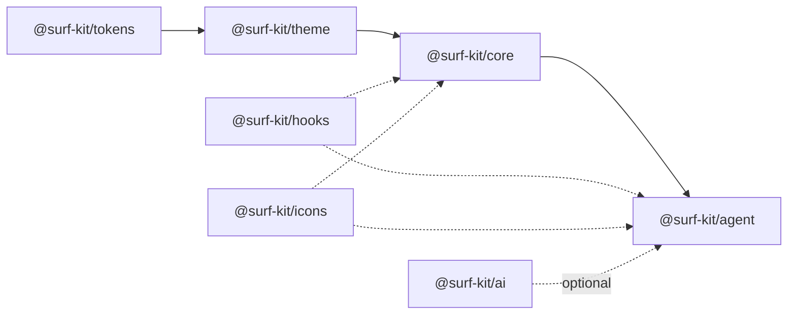

<div align="center">
  
  <h1>surf-kit</h1>
  <strong>The AI-first design system for agent interfaces</strong>
  <br />
  <em>100 accessible React components for conversational AI</em>
  <br /><br />

[](https://www.npmjs.com/package/@surf-kit/core)
[](https://github.com/barney-w/surf-kit/actions)
[](https://www.typescriptlang.org)
[](https://www.w3.org/TR/WCAG21/)
[](./LICENSE)

[Storybook](https://barney-w.github.io/surf-kit/storybook) · [Quick Start](#quick-start) · [Packages](#packages) · [Contributing](./CONTRIBUTING.md)

</div>

---

## Quick Start

```bash
npm install @surf-kit/core @surf-kit/agent @surf-kit/theme @surf-kit/tokens
```

```tsx
import { ThemeProvider } from '@surf-kit/theme'
import { AgentChat } from '@surf-kit/agent'
import '@surf-kit/tokens/css'

function App() {
  return (
    <ThemeProvider defaultColorMode="system">
      <AgentChat endpoint="/api/chat" title="Assistant" />
    </ThemeProvider>
  )
}
```

<details>
<summary><strong>Custom layout with primitives</strong></summary>

```tsx
import { ThemeProvider } from '@surf-kit/theme'
import { MessageThread, MessageComposer } from '@surf-kit/agent/chat'
import { StreamingMessage } from '@surf-kit/agent/streaming'
import { useAgentChat } from '@surf-kit/agent/hooks'
import '@surf-kit/tokens/css'

function App() {
  const { state, actions } = useAgentChat({ apiUrl: '/api/chat' })

  return (
    <ThemeProvider defaultColorMode="system">
      <MessageThread messages={state.messages}>
        {state.isStreaming && <StreamingMessage stream={state.stream} />}
      </MessageThread>
      <MessageComposer onSend={(text) => actions.sendMessage(text)} />
    </ThemeProvider>
  )
}
```

</details>

<details>
<summary><strong>With Vercel AI SDK</strong></summary>

```tsx
import { ThemeProvider } from '@surf-kit/theme'
import { AIChat } from '@surf-kit/ai'
import '@surf-kit/tokens/css'

function App() {
  return (
    <ThemeProvider defaultColorMode="system">
      <AIChat api="/api/chat" title="Assistant" />
    </ThemeProvider>
  )
}
```

`@surf-kit/ai` maps the Vercel AI SDK's `useChat` to surf-kit components — same UI, no custom streaming code.

```bash
npm install @surf-kit/ai
```

</details>

---

## Component Showcase

### Core Primitives

| Category       | Components                                                                                                   |
| -------------- | ------------------------------------------------------------------------------------------------------------ |
| **Layout**     | Box, Stack, Grid, Separator, Card, Accordion, AspectRatio, ScrollArea, Resizable                             |
| **Typography** | Text, VisuallyHidden                                                                                         |
| **Inputs**     | Button, IconButton, TextInput, TextArea, Select, Checkbox, RadioGroup, Switch, SearchInput, Toggle, ToggleGroup, Slider, Calendar |
| **Feedback**   | Badge, Spinner, Skeleton, Alert, Toast, ProgressBar, Avatar, AvatarRings, AvatarGenerationLoader             |
| **Overlays**   | Dialog, Popover, Tooltip, Sheet, DropdownMenu, HoverCard, Drawer, ContextMenu, Command                      |
| **Navigation** | Tabs, Breadcrumb, Sidebar, Pagination, NavigationMenu, Menubar                                               |
| **Data**       | Table, DataList, Collapsible, Carousel                                                                       |

### Agent Components

| Category      | Components                                                                                                                              |
| ------------- | --------------------------------------------------------------------------------------------------------------------------------------- |
| **Chat**      | AgentChat, MessageThread, MessageBubble, MessageComposer, ConversationList, WelcomeScreen                                               |
| **Streaming** | StreamingMessage, ThinkingIndicator, ToolExecution, TypewriterText, TypingIndicator, TextGlimmer, StreamingList, StreamingStructure, RetrievalProgress, VerificationProgress |
| **Trust**     | ConfidenceBadge, ConfidenceMeter, ConfidenceBreakdown, VerificationBadge, VerificationDetail                                            |
| **Sources**   | SourceCard, SourceList, SourceInline, SourceDrawer, SourceBadge                                                                         |
| **Identity**  | AgentAvatar, AgentLabel, AgentHandoff, RoutingIndicator                                                                                 |
| **Feedback**  | ThumbsFeedback, FeedbackDialog, FeedbackConfirmation                                                                                    |
| **Response**  | AgentResponse, ResponseMessage, StructuredResponse, FollowUpChips, ErrorResponse                                                        |
| **Layout**    | AgentFullPage, AgentPanel, AgentWidget, AgentEmbed                                                                                      |
| **MCP**       | MCPToolCall, MCPResourceView, MCPServerStatus, MCPApprovalDialog                                                                        |

[Browse all components in Storybook →](https://barney-w.github.io/surf-kit/storybook)

---

## Packages

| Package                                 | Version                                                                                                              | Description                                                  |
| --------------------------------------- | -------------------------------------------------------------------------------------------------------------------- | ------------------------------------------------------------ |
| [`@surf-kit/core`](./packages/core)     | [](https://www.npmjs.com/package/@surf-kit/core)     | UI primitives — Button, Input, Card, Table, Dialog, and more |
| [`@surf-kit/agent`](./packages/agent)   | [](https://www.npmjs.com/package/@surf-kit/agent)   | AI agent components — chat, streaming, confidence, sources   |
| [`@surf-kit/tokens`](./packages/tokens) | [](https://www.npmjs.com/package/@surf-kit/tokens) | Design tokens as CSS, JSON, and TypeScript                   |
| [`@surf-kit/theme`](./packages/theme)   | [](https://www.npmjs.com/package/@surf-kit/theme)   | ThemeProvider with light, dark, and brand modes              |
| [`@surf-kit/hooks`](./packages/hooks)   | [](https://www.npmjs.com/package/@surf-kit/hooks)   | Shared hooks — clipboard, keyboard shortcuts, media queries  |
| [`@surf-kit/ai`](./packages/ai)         | [](https://www.npmjs.com/package/@surf-kit/ai)         | Optional Vercel AI SDK adapter — maps `useChat` to surf-kit  |
| [`@surf-kit/icons`](./packages/icons)   | [](https://www.npmjs.com/package/@surf-kit/icons)   | Custom agent icons + Lucide re-exports                       |



<sup>Solid = dependency · Dotted = optional/peer</sup>

---

## Architecture

### Subpath exports

Each package exposes granular entry points so you only bundle what you use:

```ts
import { AgentChat } from '@surf-kit/agent/chat'
import { StreamingMessage } from '@surf-kit/agent/streaming'
import { SourceCard } from '@surf-kit/agent/sources'
import { ConfidenceBadge } from '@surf-kit/agent/confidence'
```

### Composition model

`AgentChat` is a composed default that connects to any SSE endpoint. For custom layouts, drop down to the primitives:

```tsx
<MessageThread messages={messages}>
  <StreamingMessage stream={stream} />
</MessageThread>
<MessageComposer onSend={handleSend} />
```

### Token pipeline

[Style Dictionary v4](https://styledictionary.com/) compiles [DTCG](https://www.designtokens.org/)-format tokens into CSS custom properties, JSON, and TypeScript. Three colour modes ship out of the box: light, dark, and brand (teal/gold).

### Accessibility

All interactive components use [React Aria 3](https://react-spectrum.adobe.com/react-aria/) for keyboard, focus, and screen reader support. [axe-core](https://www.deque.com/axe/) runs in CI to enforce WCAG 2.1 AA.

### AI SDK adapter

`@surf-kit/ai` is optional. `AgentChat` works with any SSE endpoint and provides streaming phases (thinking → searching → generating), conversation tracking, and feedback out of the box. If you already use the [Vercel AI SDK](https://sdk.vercel.ai/), `AIChat` and `useAIChat` map `useChat` to the same surf-kit UI with zero custom backend code.

---

## Tech Stack

- **React 19** with server component compatibility
- **TypeScript 5.9** in strict mode
- **Tailwind CSS 4** for utility-first styling
- **Vite 7** for lightning-fast builds
- **React Aria 3** for WCAG 2.1 AA accessible primitives
- **CVA** (class-variance-authority) for component variants
- **Style Dictionary 4** for design token compilation
- **Vitest 4** + **Testing Library** + **axe-core** for testing
- **Turborepo** for fast, cached monorepo builds
- **Changesets** for versioning and changelog management

---

## Development

```bash
git clone https://github.com/barney-w/surf-kit.git
cd surf-kit
pnpm install
pnpm build        # Build all packages
pnpm dev           # Dev mode with hot reload
pnpm test          # Run all tests
pnpm typecheck     # Type-check all packages
```

See [CONTRIBUTING.md](./CONTRIBUTING.md) for detailed development guidelines.

---

## Documentation & Resources

| Resource        | Link                                                                                     |
| --------------- | ---------------------------------------------------------------------------------------- |
| Storybook       | [barney-w.github.io/surf-kit/storybook](https://barney-w.github.io/surf-kit/storybook)   |
| Playground      | [barney-w.github.io/surf-kit/playground](https://barney-w.github.io/surf-kit/playground) |
| Contributing    | [CONTRIBUTING.md](./CONTRIBUTING.md)                                                     |
| Code of Conduct | [CODE_OF_CONDUCT.md](./CODE_OF_CONDUCT.md)                                               |
| Security        | [SECURITY.md](./SECURITY.md)                                                             |
| Changelog       | [Releases](https://github.com/barney-w/surf-kit/releases)                                |

---

## License

[0BSD](./LICENSE)

---

<div align="center">
  <a href="https://dev.to/barney-w">
    
  </a>
</div>
